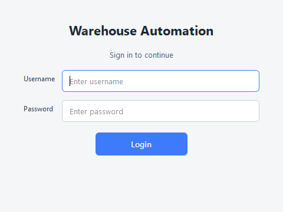
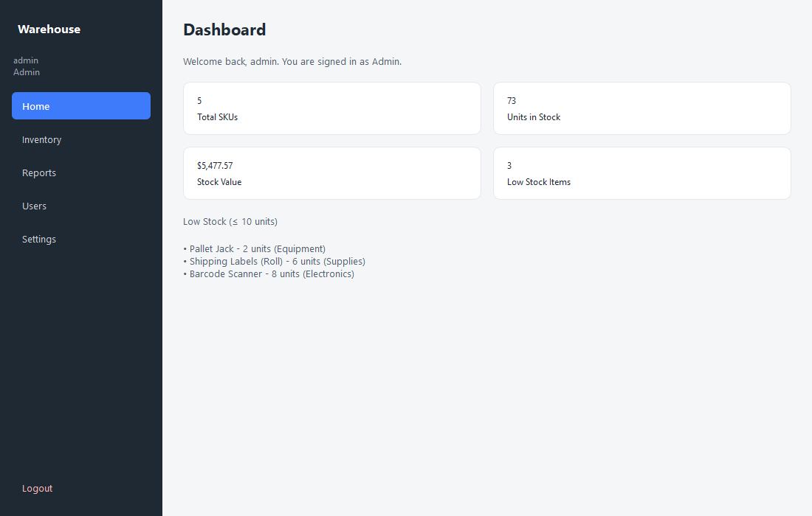
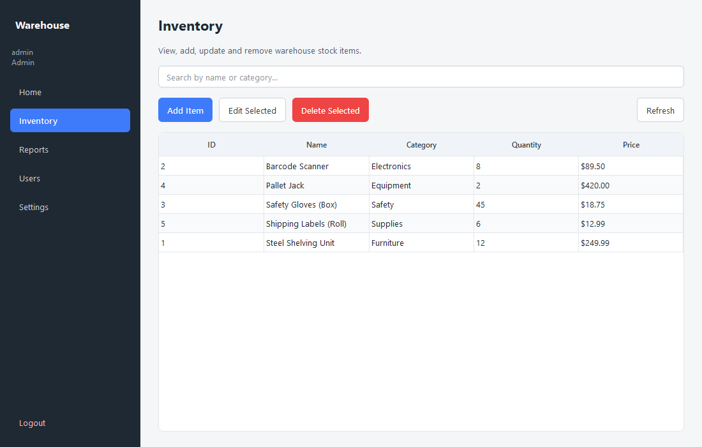
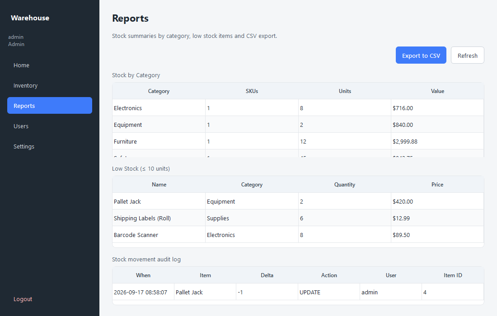
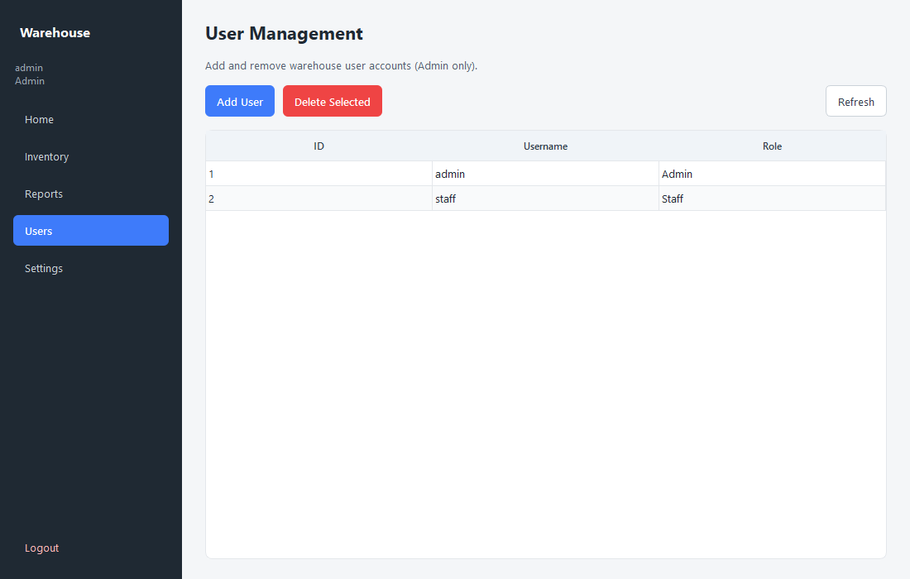
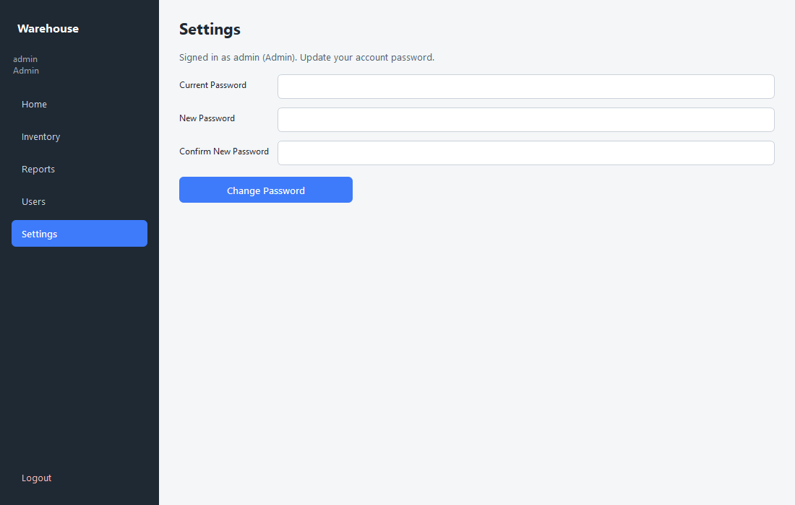
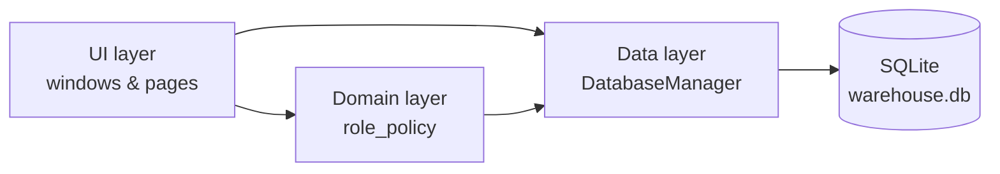

# Warehouse Automation System

Python desktop application for managing warehouse inventory, built for a university
UX/UI course project. **PyQt6** for the UI, **SQLite** for persistence, and a layered
OOP structure that separates data, domain rules and presentation.

[](https://www.python.org/)
[](https://pypi.org/project/PyQt6/)
[](https://www.sqlite.org/)
[](tests/)
[](LICENSE)

**[Architecture](docs/ARCHITECTURE.md) · [API Reference](docs/API.md) · [Contributing](CONTRIBUTING.md)**

## Screenshots

| Login | Dashboard |
|---|---|
|  |  |

| Inventory | Reports |
|---|---|
|  |  |

| User management | Settings |
|---|---|
|  |  |

## Features

- **Login** with SHA-256 hashed passwords (default: `admin` / `admin123`, role: Admin)
- **Dashboard** with live SKU, unit, value and low stock metrics
- **Inventory** CRUD (Admin and Staff), user management remains Admin only
- **Reports** — stock by category, low stock list, movement audit log, CSV export
- **User management** (Admin only) — add and delete users with Admin or Staff roles
- **Settings** — change password for the signed in account
- **Stock audit log** — every add, quantity update and delete is recorded with user and timestamp

## Architecture at a glance

Three layers, each only calling the one below it: **UI** (PyQt6 windows/pages) →
**Domain** (role permissions) → **Data** (SQLite access, dataclasses). Full
diagrams, the database schema and design rationale are in
[docs/ARCHITECTURE.md](docs/ARCHITECTURE.md).



## Requirements

- Python 3.10 or newer
- Dependencies in `requirements.txt`

## Setup and run

```bash
git clone https://github.com/arturrw/Warehouse-automation-system.git
cd Warehouse-automation-system
python -m venv .venv
.venv\Scripts\activate
pip install -r requirements.txt
python main.py
```

On first run, `warehouse.db` is created in the project folder with sample inventory
and the default admin user.

### Roles

1. Sign in as **admin** / **admin123**.
2. Use **Users** to create a Staff account (`staff` / `staff123`).
3. Sign out and sign in as Staff to manage inventory and reports without the
   **Users** menu.

## Run tests

```bash
pip install -r requirements.txt
python -m pytest tests/ -v
```

## Project structure

```
warehouse_system/
├── app.py                    # Bootstraps QApplication, DB and the login window
├── data/                      # Persistence layer
│   ├── db_manager.py          # SQLite schema, auth, inventory CRUD, reports, audit log
│   └── models.py               # Domain dataclasses shared across layers
├── domain/                    # Business rules, no Qt/SQL imports
│   └── role_policy.py          # Admin vs Staff permission helpers
└── ui/                         # PyQt6 presentation layer
    ├── login_window.py
    ├── dashboard_window.py     # Sidebar shell and page router
    ├── styles.py                # Fusion theme and stylesheets
    ├── table_helpers.py         # Shared QTableWidget configuration
    └── pages/
        ├── home_page.py         # Dashboard metrics
        ├── inventory_page.py    # Inventory table and dialogs
        ├── reports_page.py      # Reports, audit log, CSV export
        ├── users_page.py        # User management (Admin)
        └── settings_page.py     # Change password

main.py                        # `python main.py` entry point
tests/test_db_manager.py       # Pytest coverage for the database layer
docs/                          # Architecture, API reference, screenshots
```

See [docs/ARCHITECTURE.md](docs/ARCHITECTURE.md) for how the layers interact and
[docs/API.md](docs/API.md) for the full `DatabaseManager` method reference.

## Database

Tables: `Users`, `Inventory`, `StockMovements`. Schema details in
[docs/ARCHITECTURE.md](docs/ARCHITECTURE.md#database-schema).

## Contributing

Bug reports and pull requests are welcome — see [CONTRIBUTING.md](CONTRIBUTING.md)
for the dev setup, code style and test expectations.

## License

MIT — see [LICENSE](LICENSE).
