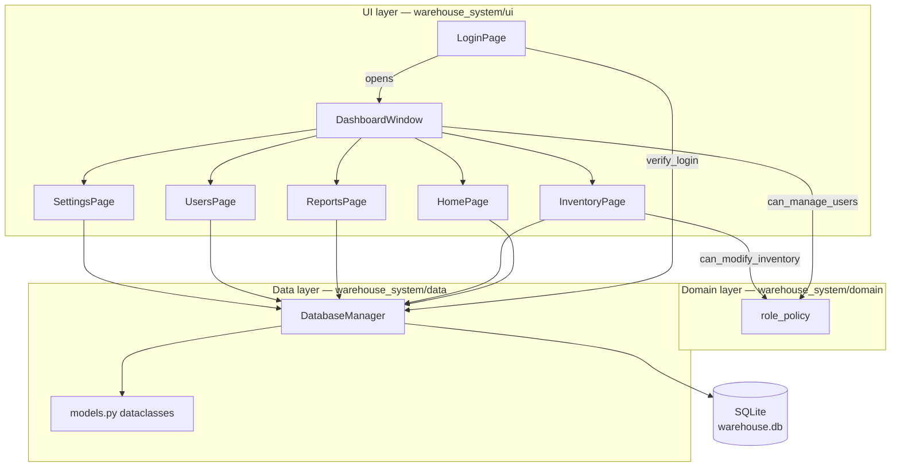
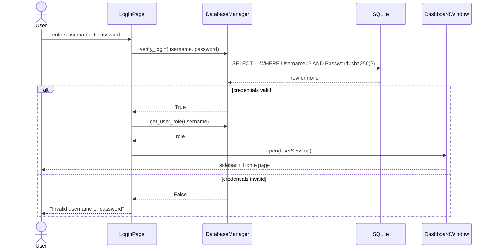
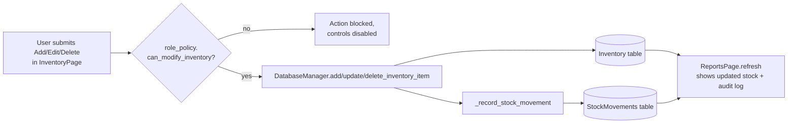

# Architecture

The application is a single-process PyQt6 desktop app split into three layers. Each
layer only talks to the layer directly below it — the UI never touches SQLite
directly, and the data layer never imports Qt.

```
warehouse_system/
├── app.py               # Bootstraps QApplication, DB and the login window
├── ui/                   # Presentation layer (PyQt6)
│   ├── login_window.py
│   ├── dashboard_window.py  # Sidebar shell + page router
│   ├── styles.py             # Fusion palette + QSS stylesheet
│   ├── table_helpers.py      # Shared QTableWidget configuration
│   └── pages/
│       ├── home_page.py
│       ├── inventory_page.py
│       ├── reports_page.py
│       ├── users_page.py
│       └── settings_page.py
├── domain/               # Business rules, no Qt or SQL imports
│   └── role_policy.py    # Admin vs. Staff permission checks
└── data/                 # Persistence layer
    ├── db_manager.py     # SQLite access, schema, auth, audit log
    └── models.py         # Frozen dataclasses shared across layers
```

## Layers

### 1. Data layer (`warehouse_system/data`)

`DatabaseManager` owns the SQLite connection and is the **only** module that writes
SQL. It exposes plain Python methods (`verify_login`, `add_inventory_item`,
`get_dashboard_stats`, ...) that return dataclasses from `models.py` instead of raw
rows or cursors, so nothing outside this module needs to know the schema.

Every inventory mutation (`add_inventory_item`, `update_inventory_item`,
`delete_inventory_item`) writes a row to `StockMovements` in the same transaction,
which is what powers the audit log in Reports.

### 2. Domain layer (`warehouse_system/domain`)

`role_policy.py` is intentionally the only module with zero PyQt6 and zero SQLite
imports. It encodes the two roles (`Admin`, `Staff`) and the permission checks
(`can_modify_inventory`, `can_manage_users`) as pure functions, so the rule "only
Admins manage users" is defined once and reused by both the UI (to hide/disable
controls) and can be unit tested without a database or a display.

### 3. UI layer (`warehouse_system/ui`)

Built with PyQt6 widgets, no business logic:

- `login_window.py` — collects credentials, calls `DatabaseManager.verify_login`,
  opens `DashboardWindow` on success.
- `dashboard_window.py` — sidebar navigation + `QStackedWidget` page router. Calls
  `page.refresh()` whenever a page becomes visible so data is always current.
- `pages/*.py` — one widget per feature area. Each page only depends on
  `DatabaseManager` and `role_policy`, never on another page.
- `styles.py` / `table_helpers.py` — shared look and feel so pages don't duplicate
  QSS or `QTableWidget` setup.

## Component diagram



## Login flow



## Inventory mutation + audit trail



## Database schema

| Table | Purpose | Key columns |
|---|---|---|
| `Users` | Authentication and role assignment | `ID`, `Username` (unique), `Password` (SHA-256 hash), `Role` |
| `Inventory` | Product catalog | `ItemID`, `Name`, `Category`, `Quantity`, `Price` |
| `StockMovements` | Append-only audit log | `MovementID`, `ItemID`, `ItemName`, `QuantityDelta`, `ActionType`, `Username`, `RecordedAt` |

## Design decisions

- **No ORM.** The schema is small (3 tables) and fully owned by `DatabaseManager`,
  so raw `sqlite3` with `Row` factories keeps the dependency list minimal for a
  course project while still returning typed dataclasses to callers.
- **Frozen dataclasses as the contract** between the data layer and the UI
  (`models.py`) mean pages can't accidentally mutate a record they didn't write
  back to the database.
- **Role checks are pure functions**, not decorators or middleware, because the
  app has one process and one active session — the UI calls
  `can_modify_inventory(session.role)` directly where it needs to gate a control.
- **The audit log is derived, not authoritative.** `StockMovements` rows are a
  side effect of `Inventory` writes recorded in the same transaction, so the two
  tables can never drift out of sync.
